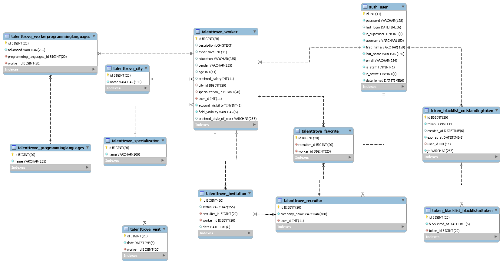

# Talent Trove

Full-stack web application built with **React (TypeScript)** and **Django REST Framework**, designed to connect IT specialists (workers) with recruiters.  

The project implements separate views and flows for guests, workers and recruiters, including registration, login, browsing candidate profiles and managing invitations.

---

## Features

### User roles

- **Guest**
  - Public landing page
  - Basic information about the platform
  - Access to selected views (e.g. list of workers) in read-only mode

- **Worker**
  - Registration and login
  - Creating and editing a personal profile (basic data, city, specialization)
  - Adding programming languages and skills
  - Viewing and managing invitations from recruiters
  - Managing own visibility and profile details

- **Recruiter**
  - Registration and login
  - Browsing the list of workers
  - Filtering workers by city, specialization and programming languages
  - Marking workers as favourites
  - Sending invitations to workers and managing their status

---

## Tech stack

**Frontend**

- React (TypeScript)
- React Router
- Functional components and hooks
- Context for navigation and API refresh handling

**Backend**

- Python / Django
- Django REST Framework
- Custom apps:
  - `siteAuth` – authentication and user management
  - `talentTrove` – domain logic (workers, recruiters, invitations, visits, etc.)
- JSON seed files for initial data:
  - cities, programming languages, specializations, users, workers, visits

**Other**

- REST API communication between frontend and backend
- Class diagram available as `Class.png` in the repository root

---

## Architecture

The project is split into two separate parts: `backend/` (Django) and `frontend/` (React).

```text
Talent-Trove/
  backend/
    backend/              # Django project settings, URLs, WSGI/ASGI
    siteAuth/             # Authentication, serializers, views, URLs
    talentTrove/          # Core domain models and logic
    seeds/                # JSON files with initial data
    templates/docs.html   # Simple API documentation page
    manage.py
    requirements.txt

  frontend/
    src/
      components/
        Guest/            # Public views (home, employee grid, info)
        Recruiter/        # Recruiter dashboard and lists
        Worker/           # Worker dashboard and profile management
        Register/         # Registration flows
        Shared/           # Navbar, footer, layout, helpers
      context/            # Navigation & API refresh helpers
      models/             # TypeScript models (Worker, Recruiter)
      App.tsx
      index.tsx
    package.json
    tsconfig.json

  .gitignore
  ERD.png               # ERD Diagram
```


---

## Running the project locally

### 1. Backend (Django)

#### Prerequisites

- Python 3.12+
- Virtual environment tool (`venv`)

#### Setup

```bash
cd backend

# Create and activate virtual environment
python -m venv venv
# Windows:
venv\Scripts\activate
# Linux/macOS:
# source venv/bin/activate

# Install dependencies
pip install -r requirements.txt

# Apply migrations
python manage.py migrate

```

#### Run the backend

```bash
python manage.py runserver
```

By default the API will be available at:

```text
http://localhost:8000/
```

---

### 2. Frontend (React)

#### Prerequisites

- Node.js (recommended 18+)
- npm or yarn

#### Setup and run

```bash
cd frontend
npm install
npm start
```

By default the frontend runs at:

```text
http://localhost:3000/
```

The frontend is configured to communicate with the backend running on `http://localhost:8000` (adjust in the code/configuration if needed).

---

## Selected screens (concept)

- **Guest Home** – public landing page with basic information  
- **Worker Home** – dashboard for a logged-in worker (profile, invitations)  
- **Recruiter Home** – dashboard for a logged-in recruiter (lists, favourites, invitations)  
- **Workers list** – table/grid of workers with filters (city, specialization, languages)  
- **Worker details** – detailed profile view with skills and experience  
- **Invitations** – lists of sent/received invitations for both workers and recruiters  
- **Registration and login** – separate flows for workers and recruiters  

---

## Data model (high-level)

The backend uses a relational model to represent the recruitment domain. Examples of entities:

- **City** – available locations  
- **Specialization** – worker specializations  
- **ProgrammingLanguages** – available programming languages  
- **Worker** – worker profile with relations to city, specialization and languages  
- **Recruiter** – recruiter profile  
- **Invitation** – invitations from recruiters to workers, with status and date  
- **Visit** – information about profile visits  

Initial values for these entities are provided in JSON files in the `backend/seeds/` directory.

---